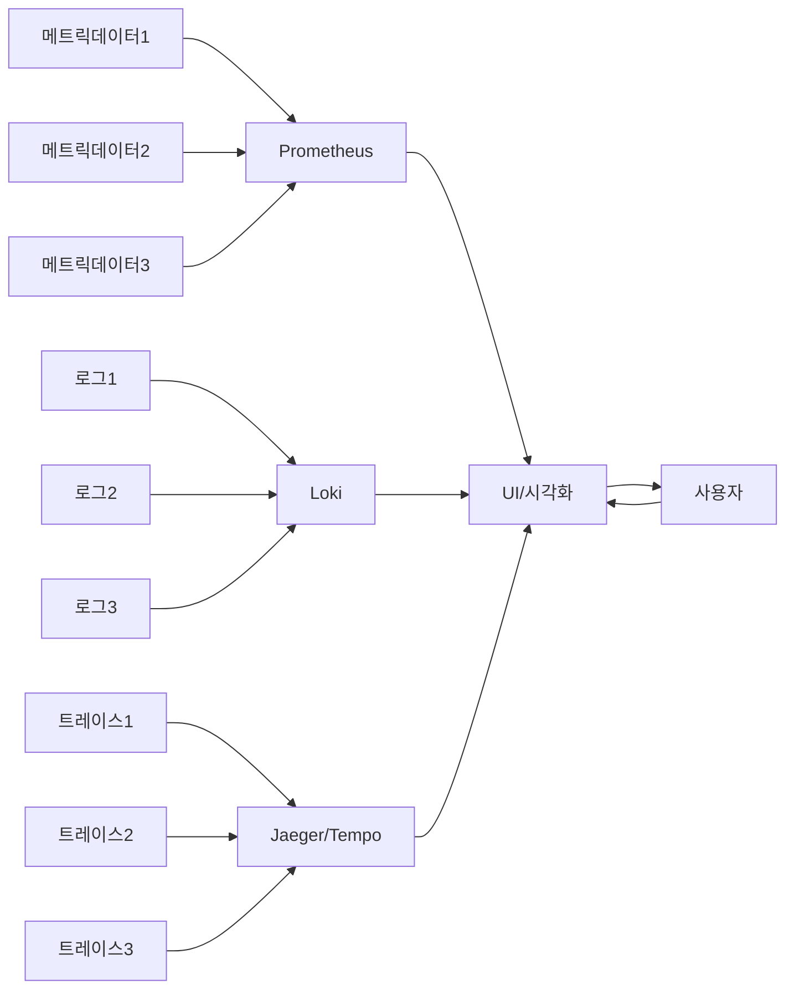
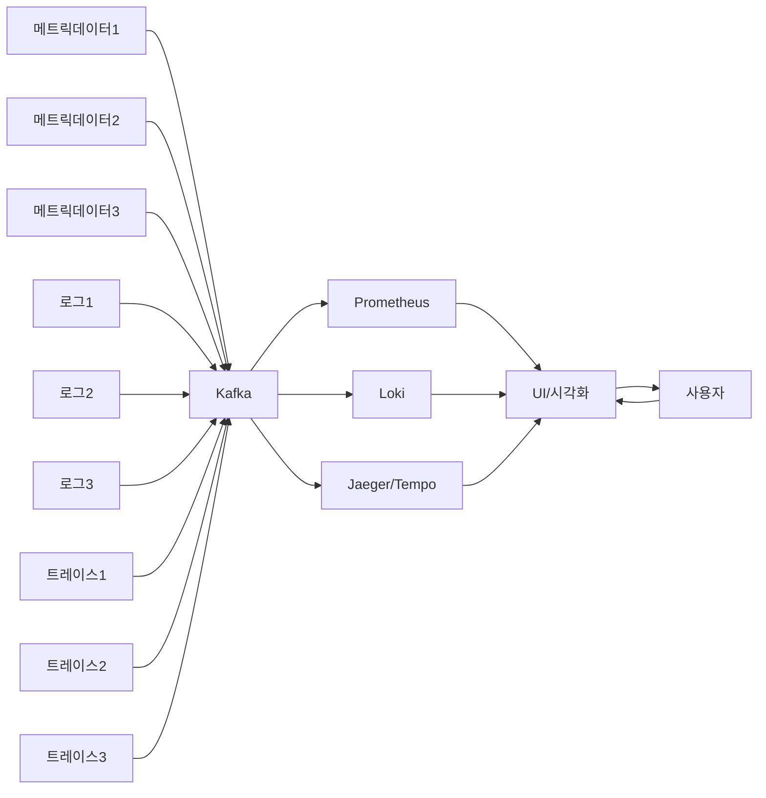

# 1. Observability 란?
Observability는 '관찰가능성'  이라는 뜻이다.  
시스템의 외부 출력에 대한 결과 값으로부터 시스템 내부상태를 얼마나 잘 추론 할 수 있는지를 나타내는 척도이다.  
엔지니어가 생성된 데이터(메트릭, 로그, 트레이스 등)를 기반으로 시스템을 분석하고 최적화 할 수 있도록 돕는다.  
모든 운영 데이터와 어플리케이션과 인프라에 대해 질문(query)을 하여 시스템의 동작을 이해하고 성능 개선에 필요한 답변을 얻을 수 있다.

## 1-2. 현대에 옵저버빌리티가 필요한 이유
현대의 시스템은 쿠버네티스 클러스터, 클라우드 인프라 에서 실행되는 MSA 구조의 복잡한 구조이다.  
이러한 구조에서 어디서 서비스 병목현상이 발생하는지 관측하고(Trace), 서버의 문제(메트릭데이터), 어플리케이션의 오류인지(로그)를 빠르게 확인해
시스템이 탄력성(Resilience)을 갖출 수 있다.

# 2. Observability 구현
Observability를 구현하기 위한 툴은 여러가지가 있고 그 중 어떤 툴을 선택하는지는 엔지니어의 선택이다.  
상당수는 오픈소스로 있기때문에 무료로도 충분히 구현이 가능하다.  
그중 일부분을 소개하자면,

**메트릭데이터**
* Prometheus
* Mimir
* Zabbix

**로그 모니터링**
* Loki
* ElasticSearch

**트레이스**
* Jaeger
* Tempo

**시각화**
* Grafana
* Datadog

대부분의 툴은 서버 <-> 에이전트의 방식으로 이뤄져있다.  
메트릭데이터로 예를 들자면, node exporter를 모니터링 대상 서버(물리적서버, 컨테이너, VM 모두 해당) 에 설치하고 실행한다.  
실행하면 node exporter는 해당 서버의 메트릭데이터를 수집한다. 이후 Prometheus가 node exporter로부터 수집한 데이터를 scrape하고, 사용자는 PromQL(Prometheus의 쿼리 언어) 를 통해 원하는 데이터를 얻을 수 있다.

트레이스의 경우 조금 다른데, 트레이스는 해당 서비스 코드에 `Span`을 생성하는 코드를 작성해야한다.
Span이란 서비스가 엔드포인트로 가는 일련의 작업을 말한다.
예를들어 사용자가 `/main` 으로 요청을 보내면 `/main`으로 요청하고 응답이 되기까지의 작업을 `Span`이라고 한다.  
만약 `/login`으로 보내면 로그인 서비스는 DB까지 갔다오는 작업을 한다면, `/login`을 `Root span` 이라고 하고, 이후 `/login`에서 DB로 가는 Span을 `Child span` 이라고 한다.  
이 `Span`에는 걸린 시간, 응답 값 등을 볼 수 있기 때문에 서비스의 병목 현상을 관측 할 수 있다.

# 3. 아키텍처

1. 직접 수집 방식

**장점**
* 간단한 아키텍처:
>데이터가 각 시스템(Prometheus, Loki, Jaeger/Tempo)에 바로 전달되어 복잡도가 낮음.
Kafka와 같은 중간 계층이 없기 때문에 설정 및 운영 비용이 줄어듦.

* 낮은 지연 시간:
>데이터가 중간 브로커 없이 직접 수집되므로, 실시간 분석에서 지연 시간이 적음.

* 오버헤드 감소:
>Kafka 등의 브로커를 위한 추가적인 인프라 리소스가 필요하지 않음.
네트워크 트래픽도 단순화됨.

* 데이터의 즉시 가용성:
>데이터가 수집 시스템에 직접 전달되므로 수집 이후 바로 사용할 수 있음.

**단점**
* 확장성 제한:
>대량의 데이터를 동시에 처리하려면 각 수집 시스템(Prometheus, Loki, Jaeger)의 부하가 직접 증가.
데이터 소스가 많아질수록 수집 시스템에 병목이 발생할 가능성이 높음.

* 유연성 부족:
> 데이터가 특정 포맷과 수집 시스템에 의존적이어서, 데이터를 재처리하거나 다른 시스템으로 쉽게 전달하기 어려움.

* 단일 장애점(SPOF):
>각 수집 시스템(Prometheus, Loki 등)이 단일 장애점이 될 가능성이 큼.
수집 시스템의 장애가 발생하면 데이터 손실 가능성 있음.

* 데이터 처리 옵션 제한:
>데이터를 필터링, 집계, 변환하는 등의 작업을 유연하게 처리하기 어려움.

2. 중간 계층 활용(중앙화)

**장점**
* 확장성:
>Kafka는 높은 처리량과 확장성을 제공하며, 다량의 데이터 소스를 병렬 처리 가능.
시스템이 확장되어도 Kafka가 데이터를 효율적으로 분산 처리.
* 내구성 및 신뢰성:
>데이터가 Kafka에 저장되므로, 수집 시스템(Prometheus, Loki, Jaeger)이 일시적으로 다운되어도 데이터가 손실되지 않음.
데이터 재처리가 가능.
* 유연성:
>Kafka의 데이터를 여러 소비자(Prometheus, Loki, Jaeger/Tempo)와 동시에 공유 가능.
데이터 변환, 필터링, 집계 등의 추가 처리를 브로커 단계에서 수행 가능.

* 고립된 장애 관리:
>데이터 소스와 소비자 간에 브로커(Kafka)가 중간 계층 역할을 하기 때문에, 특정 수집 시스템이 다운되더라도 다른 시스템에는 영향을 미치지 않음.

* 데이터 재활용 가능:
>데이터는 Kafka에 저장되기 때문에, 다양한 소비자나 시스템에서 동일한 데이터를 활용 가능.
새로운 수집 시스템을 추가하기 용이.

**단점**
* 복잡성 증가:
>Kafka 브로커 및 관련 인프라(Zookeeper 등)를 설정하고 운영해야 함.
Kafka 클러스터와 수집 시스템 간의 통합 작업이 필요.

* 추가 비용:
>Kafka를 위한 인프라 리소스 및 운영 비용이 발생.
Kafka 클러스터가 확장되면 비용도 증가.

* 지연 시간 증가:
>데이터가 Kafka를 경유하기 때문에 실시간 데이터 처리 시 지연이 약간 증가할 수 있음.
특히 데이터 필터링, 집계 등을 Kafka에서 수행할 경우 추가 처리 시간이 발생.

* 복구 및 장애 관리 부담:
>Kafka 장애 시 전체 데이터 흐름에 문제가 생길 수 있으며, 복구 절차가 복잡함.

---
[참고1](https://newrelic.com/kr/blog/best-practices/what-is-observability)  
[참고2](https://vector.dev/docs/setup/deployment/topologies/#distributed)
